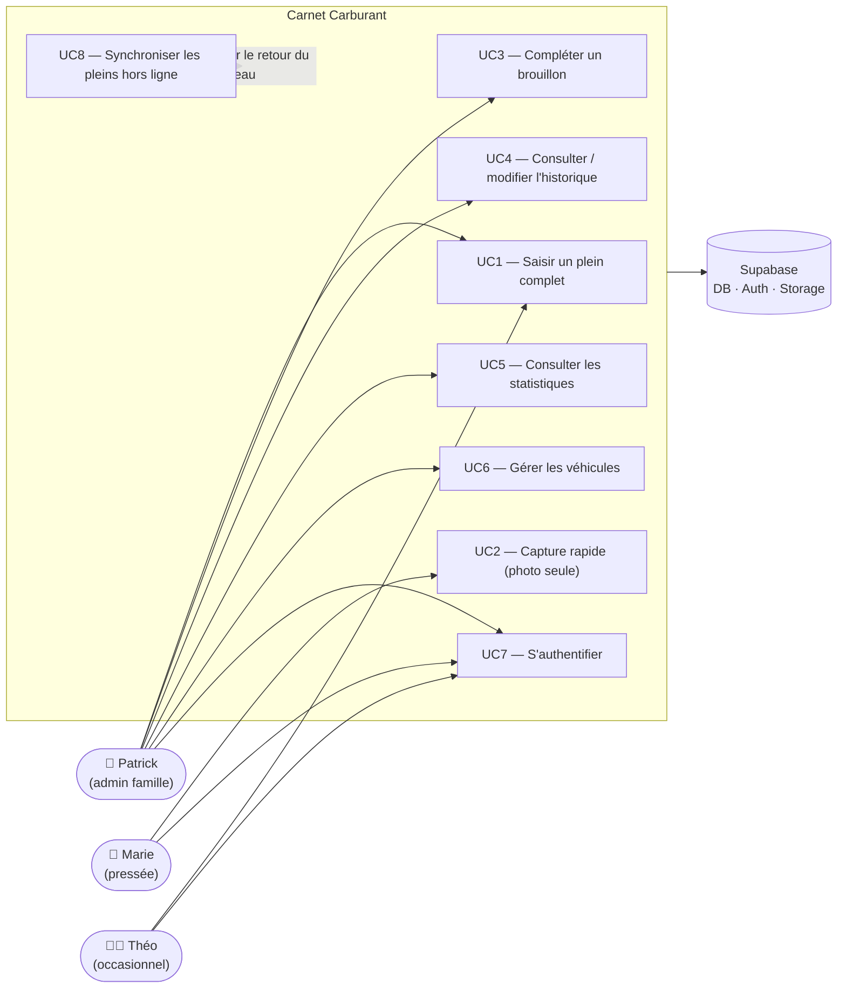
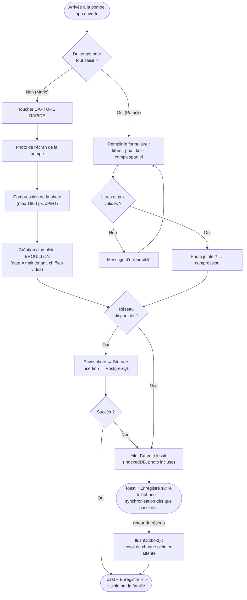
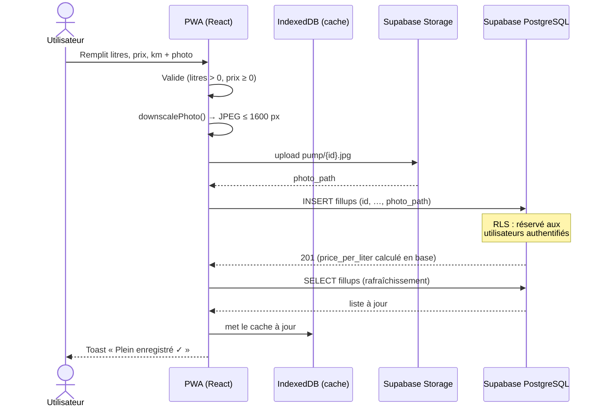
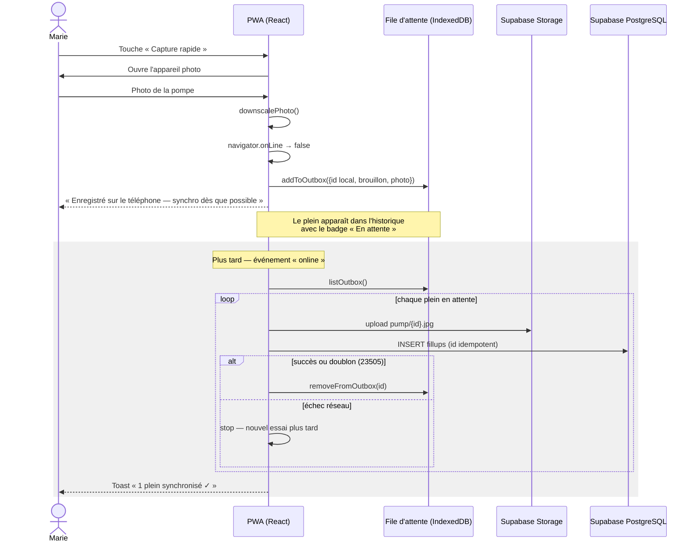
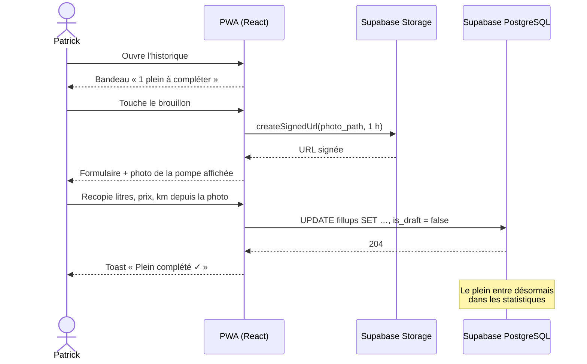
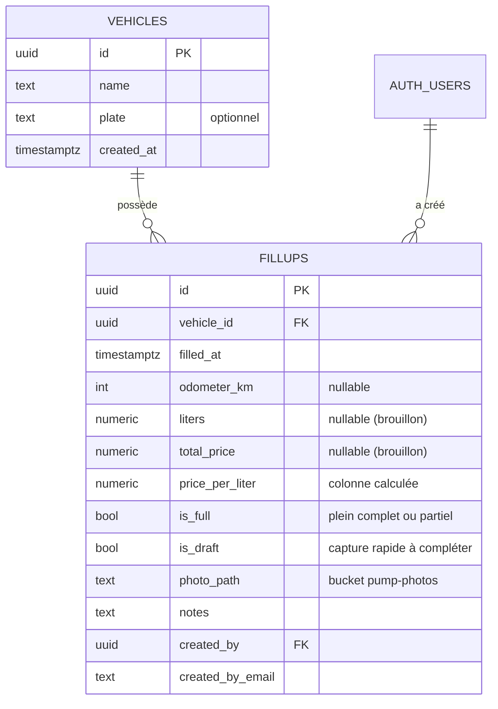

# Carnet Carburant — Spécifications fonctionnelles

> PWA familiale de suivi des pleins de carburant — plusieurs véhicules, plusieurs
> utilisateurs, photos de pompe, saisie hors ligne, historique partagé et statistiques.
>
> Production : <https://carnet-carburant.vercel.app> · Code : `github.com/pkalumel/carnet-carburant`

---

## 1. Vue d'ensemble

| Élément | Choix |
|---|---|
| Type | PWA installable (mobile d'abord) |
| Front | React + Vite + TypeScript |
| Backend | Supabase (PostgreSQL + Auth + Storage) |
| Partage | Tous les comptes authentifiés voient les mêmes données (famille) |
| Hors ligne | Création de pleins (photo comprise) en file d'attente locale, synchronisation automatique |
| Unités | €, litres, kilomètres — consommation en L/100 km |

**Proposition de valeur** : enregistrer un plein en moins de 10 secondes à la pompe
(au pire : une photo), et en tirer des statistiques fiables de consommation et de coût
pour toute la famille.

---

## 2. Personas

### P1 — Patrick, le conducteur-administrateur
- **Profil** : parent, à l'aise avec la technologie, a mis en place l'application.
- **Contexte** : fait la majorité des pleins de la voiture principale ; veut des
  chiffres fiables (L/100 km, coût mensuel) pour décider notamment d'un éventuel
  changement de véhicule.
- **Objectifs** : saisie complète avec kilométrage à chaque plein ; consulter les stats.
- **Frustrations** : les carnets papier perdus, les tableurs jamais à jour, les apps
  qui exigent un compte par abonnement.

### P2 — Marie, la conductrice pressée
- **Profil** : conjointe, utilise l'app uniquement à la station-service.
- **Contexte** : fait le plein en allant au travail, souvent pressée, réseau parfois
  médiocre à la station.
- **Objectifs** : que ça prenne moins de 10 secondes — une photo de la pompe suffit,
  quelqu'un (ou elle, plus tard) complétera les chiffres.
- **Frustrations** : les formulaires longs ; devoir se souvenir de transmettre le ticket.

### P3 — Théo, le jeune conducteur occasionnel
- **Profil** : enfant devenu conducteur, emprunte la seconde voiture.
- **Contexte** : fait rarement le plein, ne connaît pas les habitudes de saisie.
- **Objectifs** : une interface évidente qui le guide (champs requis, véhicule
  présélectionné) ; prouver qu'il a bien remis de l'essence.
- **Frustrations** : les apps où l'on peut « mal faire » sans s'en rendre compte.

---

## 3. Cas d'utilisation

### Diagramme d'ensemble

### UC1 — Saisir un plein complet
| | |
|---|---|
| **Acteur** | Tout membre authentifié |
| **Préconditions** | Connecté ; au moins un véhicule existe |
| **Scénario nominal** | 1. Ouvrir l'onglet « Plein » · 2. Choisir le véhicule (présélectionné) · 3. Saisir litres et prix total — le €/L se calcule en direct · 4. Saisir le kilométrage (recommandé) · 5. Cocher/décocher « plein complet » · 6. Joindre éventuellement la photo de la pompe · 7. Enregistrer |
| **Alternatives** | 3a. Litres ou prix manquants → blocage avec message · 7a. Réseau absent/échec → le plein part en file d'attente locale (voir UC8), l'utilisateur est informé |
| **Postconditions** | Le plein est visible par toute la famille dans l'historique et compté dans les stats |

### UC2 — Capture rapide
| | |
|---|---|
| **Acteur** | Tout membre (typiquement Marie) |
| **Préconditions** | Connecté ; véhicule sélectionné |
| **Scénario nominal** | 1. Toucher le bouton « Capture rapide » · 2. L'appareil photo s'ouvre, photographier l'écran de la pompe · 3. L'app compresse la photo et enregistre un plein **brouillon** (date = maintenant, chiffres vides) · 4. Bascule automatique vers l'historique où le brouillon porte le badge « À compléter » |
| **Alternatives** | 3a. Hors ligne → brouillon + photo en file d'attente locale (UC8) |
| **Postconditions** | Un brouillon horodaté avec photo existe ; les stats l'ignorent tant qu'il n'est pas complété |

### UC3 — Compléter un brouillon
| | |
|---|---|
| **Acteur** | Tout membre (pas forcément l'auteur de la photo) |
| **Préconditions** | Un brouillon existe ; être en ligne |
| **Scénario nominal** | 1. Ouvrir l'historique — un bandeau compte les brouillons · 2. Toucher le brouillon · 3. La photo de la pompe s'affiche au-dessus du formulaire · 4. Recopier litres, prix, kilométrage depuis la photo · 5. Enregistrer → le plein devient définitif |
| **Alternatives** | 5a. Litres/prix manquants → blocage avec message |

### UC4 — Consulter / modifier l'historique
Liste antichronologique filtrable par véhicule (sélecteur global). Chaque ligne montre
date, véhicule, litres, prix, €/L, kilométrage, auteur, badges (« À compléter »,
« Partiel », « En attente »), vignette photo. Toucher une ligne ouvre l'éditeur :
modification de tous les champs, remplacement de photo, suppression (avec confirmation).
Les pleins « en attente » (hors ligne, non synchronisés) ne sont pas modifiables.

### UC5 — Consulter les statistiques
- **Par véhicule** : consommation moyenne pondérée et par période (L/100 km), coût au
  km, total dépensé, prix moyen du litre, courbe de consommation, dépense par mois,
  évolution du €/L.
- **Tous véhicules** : dépense mensuelle globale + résumé par véhicule.
- **Règle métier centrale** : la consommation se calcule **entre deux pleins complets
  munis d'un kilométrage** ; les litres des pleins partiels intermédiaires sont
  additionnés dans la période. Les brouillons sont exclus.

### UC6 — Gérer les véhicules
Ajouter (nom + plaque optionnelle) et supprimer (avec confirmation ; supprime aussi
ses pleins). Accessible depuis l'onglet « Plein ».

### UC7 — S'authentifier
Email + mot de passe (Supabase Auth). Création de compte ouverte pendant la phase
d'installation familiale, puis **fermée par l'administrateur** — la sécurité des
données repose sur ce verrouillage (voir §6).

### UC8 — Synchronisation hors ligne
Déclencheur : retour du réseau (`online`) ou ouverture de l'app. Chaque plein en file
d'attente est envoyé (photo d'abord, puis ligne en base, identifiant idempotent) ;
en cas de succès il quitte la file. L'utilisateur voit « N pleins synchronisés ✓ ».

---

## 4. Diagramme de flux — enregistrer un plein à la pompe

---

## 5. Diagrammes de séquence

### 5.1 Saisie complète en ligne (UC1)

### 5.2 Capture rapide hors ligne puis synchronisation (UC2 + UC8)

### 5.3 Complétion d'un brouillon (UC3)

---

## 6. Modèle de données

**Sécurité** : RLS activé sur toutes les tables — lecture/écriture réservées au rôle
`authenticated`. Bucket photos privé (URLs signées, 1 h). Le modèle « tout utilisateur
connecté voit tout » impose de **fermer les inscriptions publiques** une fois les
comptes familiaux créés (Dashboard Supabase → Authentication → Sign In / Up).

---

## 7. Exigences non fonctionnelles

| Domaine | Exigence |
|---|---|
| Hors ligne | L'app se charge sans réseau (service worker) ; création de pleins hors ligne ; consultation du dernier état connu (cache IndexedDB) |
| Performance | Bundle initial ≈ 420 kB (stats chargées à la demande) ; photos compressées avant envoi |
| Accessibilité | Contrastes WCAG AA ; cibles tactiles ≥ 44 px ; focus visible ; `prefers-reduced-motion` respecté ; libellés sur tous les champs |
| Ergonomie mobile | Claviers numériques (`inputmode`) ; virgule ou point acceptés ; saisie à une main visée |
| Fiabilité | Synchronisation idempotente (id fixes, doublon 23505 toléré) ; scripts d'envoi atomiques |
| Coût | Gratuit à l'échelle familiale (Supabase free tier, Vercel hobby) |
| Limite connue | La **modification** d'un plein exige d'être en ligne ; seule la **création** fonctionne hors ligne |
