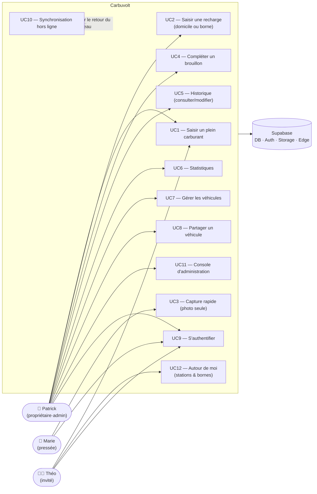
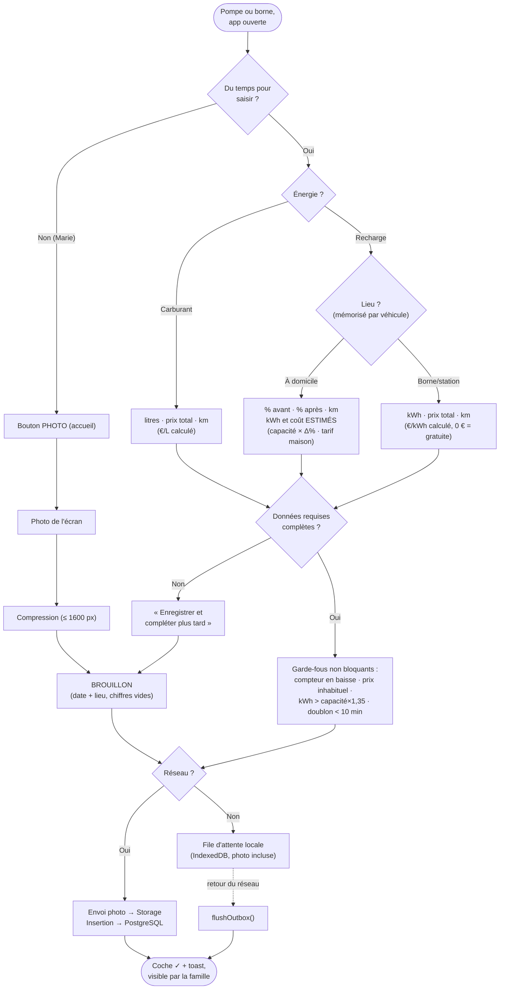
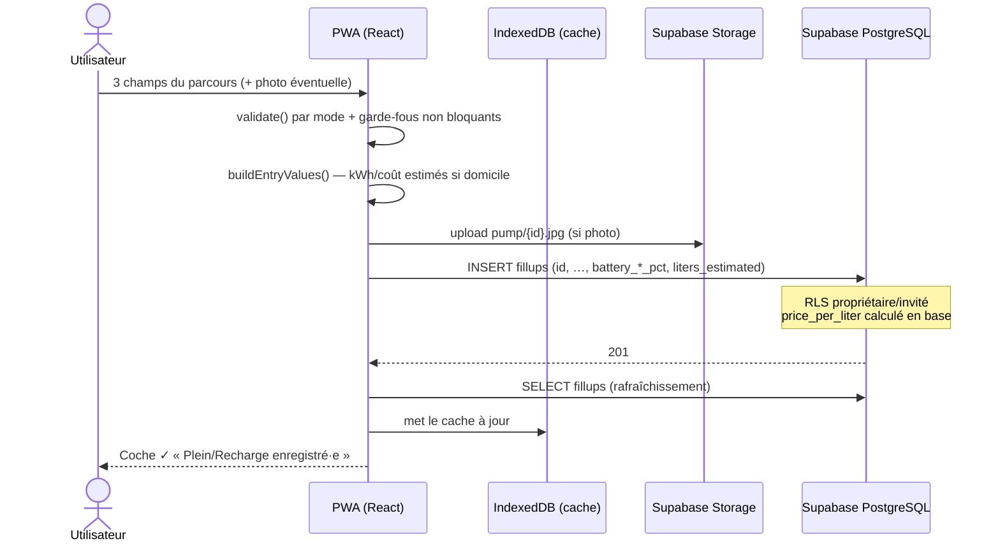
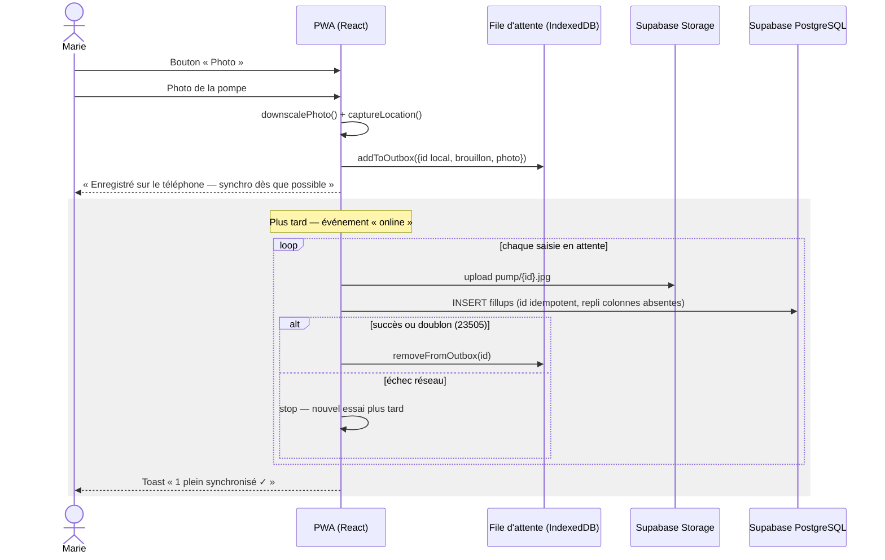
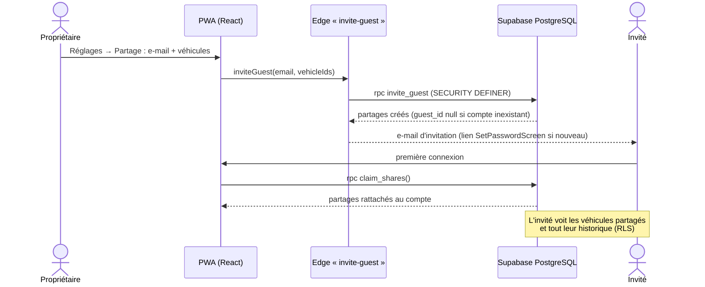
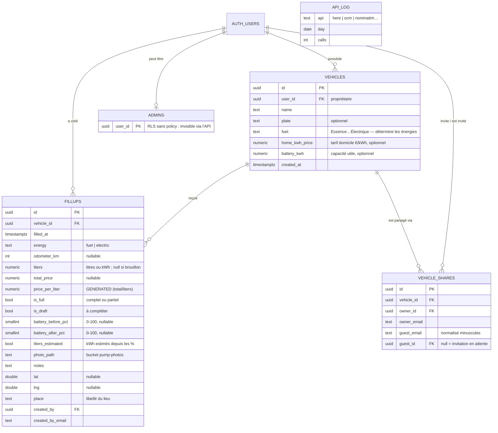

# Carbuvolt — Spécifications fonctionnelles

> PWA familiale de suivi des pleins de carburant **et des recharges
> électriques** — plusieurs véhicules, plusieurs utilisateurs, partage par
> invitation, photos de pompe, saisie hors ligne, historique partagé,
> statistiques et console d'administration.
>
> Production : <https://carnet-carburant.vercel.app> · Code : `github.com/pkalumel/carnet-carburant`
>
> Dernière mise à jour : 30 août 2026 (formulaire adaptatif 3 champs,
> recharges domicile estimées, capacité batterie).

---

## 1. Vue d'ensemble

| Élément | Choix |
|---|---|
| Type | PWA installable (mobile d'abord) |
| Front | React + Vite + TypeScript |
| Backend | Supabase (PostgreSQL + Auth + Storage + fonctions edge) |
| Énergies | Carburant (litres) et électricité (kWh), selon le carburant du véhicule ; un hybride rechargeable enregistre les deux |
| Partage | Chaque véhicule appartient à un utilisateur ; le propriétaire **invite** d'autres personnes par e-mail (RLS propriétaire/invité, voir §6) |
| Hors ligne | Création de saisies (photo comprise) en file d'attente locale, synchronisation automatique |
| Unités | €, litres, kWh, kilomètres — conso en L/100 km et kWh/100 km |

**Proposition de valeur** : enregistrer un plein ou une recharge en moins de
10 secondes — **3 données manuelles maximum par parcours**, tout ce qui est
calculable est calculé (au pire : une photo) — et en tirer des statistiques
fiables de consommation et de coût pour toute la famille.

---

## 2. Personas

### P1 — Patrick, le conducteur-administrateur
- **Profil** : parent, à l'aise avec la technologie, a mis en place l'application.
- **Contexte** : foyer en électrification (un hybride rechargeable, un
  électrique) ; recharge surtout à domicile, où il n'y a pas de compteur kWh —
  seulement le % de batterie du tableau de bord. Veut des chiffres fiables
  (L/100, kWh/100, coût mensuel, coût au km).
- **Objectifs** : saisie complète avec kilométrage ; stats par énergie ; inviter
  la famille sur ses véhicules.
- **Frustrations** : les carnets papier perdus, les tableurs jamais à jour, les
  apps à abonnement, les formulaires qui demandent des données qu'il n'a pas
  (kWh d'une recharge à la maison).

### P2 — Marie, la conductrice pressée
- **Profil** : conjointe, utilise l'app uniquement à la station.
- **Contexte** : plein en allant au travail, souvent pressée, réseau parfois
  médiocre à la station.
- **Objectifs** : moins de 10 secondes — une photo de la pompe suffit,
  quelqu'un (ou elle, plus tard) complétera les chiffres.
- **Frustrations** : les formulaires longs ; devoir transmettre le ticket.

### P3 — Théo, le jeune conducteur occasionnel
- **Profil** : enfant devenu conducteur, invité sur la seconde voiture.
- **Contexte** : fait rarement le plein, ne connaît pas les habitudes.
- **Objectifs** : une interface qui guide (3 champs, véhicule présélectionné) ;
  prouver qu'il a remis de l'essence.
- **Frustrations** : les apps où l'on peut « mal faire » sans s'en rendre compte.

---

## 3. Cas d'utilisation

### Diagramme d'ensemble

### UC1 — Saisir un plein carburant
| | |
|---|---|
| **Acteur** | Propriétaire ou invité du véhicule |
| **Préconditions** | Connecté ; au moins un véhicule |
| **Scénario nominal** | 1. Bouton « + » central (depuis n'importe quel onglet) → la saisie s'ouvre en **écran plein cadre** (en-tête fixe ✕ + titre ; le clavier n'apparaît qu'au premier tap sur un champ) · 2. Véhicule et énergie présélectionnés · 3. Saisir **litres** et **prix total** — le prix au litre s'affiche en ligne calculée, jamais saisi · 4. **Kilométrage** pré-rempli en « suggéré » (dernier relevé + habitude) · 5. « Plein complet » présélectionné (mémorisé par énergie) · 6. Photo/notes/date/lieu dans les sections repliées ou automatiques · 7. Enregistrer (bouton collant en bas) |
| **Alternatives** | 3a. Donnée requise manquante → bouton secondaire **« Enregistrer et compléter plus tard »** (brouillon « À compléter ») · 7a. Hors ligne → file d'attente locale (UC10) |
| **Postconditions** | Saisie visible par le propriétaire et les invités du véhicule, comptée dans les stats |

### UC2 — Saisir une recharge électrique
| | |
|---|---|
| **Acteur** | Propriétaire ou invité d'un véhicule électrique ou hybride rechargeable |
| **Préconditions** | Connecté ; pour le mode domicile : capacité utile de la batterie renseignée sur le véhicule (UC7) |
| **Scénario nominal** | Segment **« À domicile \| Borne ou station »**, dernière méthode mémorisée par véhicule. **À domicile** (pas de compteur kWh à la maison) : saisir **% batterie avant**, **% après**, **kilométrage** → l'app estime les kWh (capacité × Δ%) et le coût (tarif domicile) : « Environ 38,4 kWh — coût estimé 10,75 € », enregistrés avec le statut **Complet — estimation**. **Borne ou station** : saisir **kWh délivrés**, **prix total**, **kilométrage** — €/kWh calculé, % avant/après facultatifs dans « Photo et détails » |
| **Alternatives** | Domicile sans capacité renseignée → encart renvoyant vers Réglages · Borne avec prix vide et kWh saisis → chip « Recharge gratuite (0 €) » · % après ≤ % avant → **bloquant** |
| **Postconditions** | kWh (mesurés ou estimés) matérialisés dans `liters`, coût dans `total_price` ; les estimations portent `liters_estimated` (badge « Estimé », exclues de la courbe de prix) |

### UC3 — Capture rapide
| | |
|---|---|
| **Acteur** | Tout membre (typiquement Marie) |
| **Scénario nominal** | 1. Bouton « Photo » de l'accueil · 2. Photographier l'écran de la pompe/borne · 3. L'app compresse la photo et crée un **brouillon** (date + lieu = maintenant/ici, chiffres vides) · 4. Bascule vers l'historique, badge « À compléter » |
| **Alternatives** | Hors ligne → brouillon + photo en file d'attente (UC10) |
| **Postconditions** | Brouillon horodaté et géolocalisé ; ignoré des stats tant qu'incomplet |

### UC4 — Compléter un brouillon
| | |
|---|---|
| **Acteur** | Tout membre ayant accès au véhicule (pas forcément l'auteur) |
| **Préconditions** | Un brouillon existe ; être en ligne |
| **Scénario nominal** | 1. Accueil (carte « À compléter ») ou historique (bandeau) · 2. Ouvrir le brouillon — photo affichée au-dessus du formulaire · 3. Le même formulaire adaptatif que la création (3 champs par mode, y compris le mode % pour une recharge domicile) · 4. Enregistrer → statut définitif |

### UC5 — Consulter / modifier l'historique
Liste antichronologique groupée par mois (tableau sur desktop), filtrable par
véhicule (sélecteur global) et par énergie (Tous / Carburant / Recharges).
Chaque ligne : date, véhicule, litres ou kWh, prix, €/L ou €/kWh, kilométrage,
conso de la période close, lieu, auteur, badges (« ⚡ Recharge »,
« À compléter », « Estimé », « Partiel·le », « En attente »), vignette photo.
Toucher une ligne ouvre l'éditeur en plein écran (mêmes champs et garde-fous
que la création) ; glisser à gauche → Supprimer avec « Annuler » (6 s). Les saisies
« en attente » (hors ligne) ne sont pas modifiables. Un invité ne modifie ou
ne supprime que **ses** saisies.

### UC6 — Consulter les statistiques
- **Par véhicule** : conso pondérée et par période (L/100 et/ou kWh/100), coût
  au km (énergies additionnées pour un hybride), total dépensé, prix unitaire
  moyen, courbes de conso et de prix, dépense mensuelle.
- **Tous véhicules** : dépense mensuelle ventilée par véhicule.
- **Règles métier centrales** : la consommation se calcule **entre deux
  pleins/charges complets munis d'un kilométrage**, par énergie ; les volumes
  partiels intermédiaires sont additionnés dans la période. Les brouillons
  sont exclus de tout ; les recharges estimées comptent dans la conso et les
  coûts mais **pas** dans la courbe de prix (ce ne sont pas des prix de marché).

### UC7 — Gérer les véhicules
Ajouter (nom + plaque), puis en édition : carburant (Essence, Diesel, E85,
GPL, Hybride, Hybride rechargeable, Électrique — détermine les énergies
saisissables), et si l'électrique est possible : **tarif maison (€/kWh)** et
**capacité utile de la batterie (kWh)** — les deux paramètres du mode
« À domicile ». Suppression avec confirmation par frappe du nom (supprime
aussi les saisies). Seul le propriétaire modifie son véhicule.

### UC8 — Partager un véhicule
| | |
|---|---|
| **Acteur** | Propriétaire (invitation/révocation), invité (acceptation implicite) |
| **Scénario nominal** | 1. Réglages → Partage · 2. Saisir l'e-mail de l'invité et cocher les véhicules · 3. La fonction edge `invite-guest` crée le partage et envoie l'invitation (compte existant : partage immédiat ; sinon lien d'inscription vers `SetPasswordScreen`) · 4. À la première connexion, `claim_shares()` rattache les partages en attente au compte |
| **Droits de l'invité** | Voit les véhicules partagés et **tout leur historique** ; ajoute des saisies ; ne modifie/supprime que les siennes ; ne touche jamais aux véhicules. Garanti par RLS côté serveur (§6) |
| **Révocation** | Le propriétaire révoque, ou l'invité quitte le partage |

### UC9 — S'authentifier
E-mail + mot de passe (Supabase Auth). Création de compte depuis l'écran de
connexion, définition du mot de passe via lien d'invitation ou de
récupération (`SetPasswordScreen`). Changement de mot de passe dans Réglages.
Les données étant isolées par RLS au niveau propriétaire/invité, un compte
inconnu ne voit **rien** ; fermer les inscriptions publiques après
l'installation familiale reste recommandé (hygiène, quota).

### UC10 — Synchronisation hors ligne
Déclencheur : retour du réseau (`online`) ou ouverture de l'app. Chaque
saisie en file d'attente est envoyée (photo d'abord, puis ligne en base,
identifiant idempotent — doublon 23505 toléré) ; en cas de succès elle quitte
la file. Toast « N pleins synchronisés ✓ ». Le client tolère une base pas
encore migrée : les colonnes récentes absentes sont retirées de l'insert ou
de l'update et l'opération est rejouée.

### UC11 — Console d'administration
Réservée aux comptes de la table `admins` (invisible via l'API ; contrôle
`is_admin()` côté serveur, RPC `SECURITY DEFINER`). Accessible via Réglages →
« Ouvrir la console d'administration » : vue d'ensemble (comptes, véhicules,
saisies, photos), liste et détail des utilisateurs (véhicules, derniers
pleins, actions dont la suppression de compte en cascade), santé du service,
journal d'usage des API externes sur 7 jours (`api_log`).

### UC12 — Autour de moi
Carte Leaflet sur l'accueil : stations carburant ou bornes de recharge les
plus proches (onglet selon les énergies du périmètre filtré). Sources : HERE
en principal, repli OSM/Open Charge Map ; prix carburant affichés quand HERE
les fournit ; regroupement des épingles proches, popup avec itinéraire.
Jamais bloquant : géolocalisation refusée ou réseau muet → états doux.

---

## 4. Diagramme de flux — enregistrer une opération

---

## 5. Diagrammes de séquence

### 5.1 Saisie complète en ligne (UC1/UC2)

### 5.2 Capture rapide hors ligne puis synchronisation (UC3 + UC10)

### 5.3 Invitation d'un membre (UC8)

---

## 6. Modèle de données

**Statuts de complétude** (dérivés côté client, `src/lib/completeness.ts`) :
`Complet` (données réelles), `Complet — estimation` (`liters_estimated`,
kWh/coût calculés depuis les %), `À compléter` (`is_draft` ou donnée
indispensable manquante). Une saisie incomplète n'est jamais silencieusement
considérée comme complète.

**Garde-fous de saisie** (`src/lib/plausibility.ts` — avertissent sans
bloquer, sauf mention) : compteur ≤ dernier relevé ; prix unitaire hors
bornes (0,8–3 €/L, 0,05–1,2 €/kWh) ; kWh > capacité × **1,35** (marge des
pertes de recharge — une borne facture l'énergie délivrée) ; doublon du même
véhicule à < 10 min ; conso à ±40 % de la moyenne (désactivé pour les
bi-énergie, leurs km étant partagés entre énergies) ; % après ≤ % avant
(**bloquant**).

**Sécurité** : RLS sur toutes les tables. Véhicules : lecture propriétaire ou
invité, écriture propriétaire uniquement. Saisies : lecture/ajout propriétaire
ou invité, modification/suppression propriétaire du véhicule ou auteur de la
saisie. `vehicle_shares` : écritures uniquement via fonctions
`SECURITY DEFINER` (`invite_guest`, `claim_shares`). `admins` : RLS sans
policy (table invisible via l'API). Bucket photos privé (URLs signées 1 h).
`price_per_liter` est une colonne générée : jamais envoyée par le client.

---

## 7. Exigences non fonctionnelles

| Domaine | Exigence |
|---|---|
| Hors ligne | L'app se charge sans réseau (service worker) ; création de saisies hors ligne ; consultation du dernier état connu (cache IndexedDB) |
| Compatibilité | Le client tolère une base en retard de migration : replis « colonne absente » sur insert et update ; défauts appliqués à la relecture (cache et outbox non versionnés) |
| Performance | Bundle initial ≈ 420 kB (stats à la demande) ; photos compressées ≤ 1600 px avant envoi |
| Accessibilité | Contrastes WCAG AA ; cibles tactiles ≥ 44 px ; focus visible ; `prefers-reduced-motion` ; libellés partout — vérifiés par `scripts/verify-ux.mjs` |
| Ergonomie mobile | 3 champs max par parcours ; saisie et édition en écran plein cadre (en-tête fixe, jamais de clavier automatique) ; claviers numériques ; virgule ou point ; thème clair/sombre (système ou forcé) ; saisie à une main |
| Fiabilité | Synchronisation idempotente (id fixes, doublon 23505 toléré) ; suppression optimiste avec « Annuler » (6 s) |
| Vie privée | Lieu retirable à la saisie ; aucune analytics client ; photos en bucket privé |
| Coût | Gratuit à l'échelle familiale (Supabase free tier, Vercel hobby) ; jetons cartes (Mapbox/HERE/OCM) restreints à l'URL de production, usage journalisé dans `api_log` |
| Limite connue | La **modification** d'une saisie exige d'être en ligne ; seule la **création** fonctionne hors ligne |
